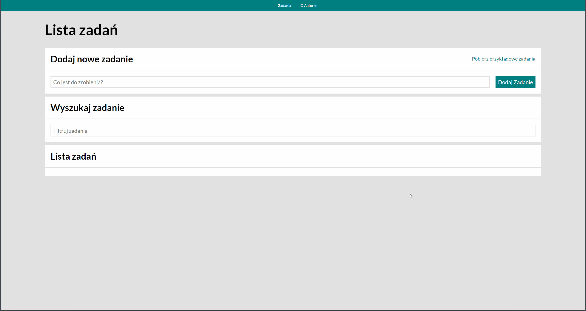

# To Do List

## Demo

[Here you can watch demo](https://xtherexuu.github.io/asc-to-do-list)

## Description

Welcome to my To-Do List application! This website allows you to efficiently manage your tasks and stay organized. With our user-friendly interface, you can easily add, edit, and delete tasks as needed. All your tasks are saved directly to your browser's local storage, ensuring your to-do list is always available whenever you need it.

### Key Features

- Add Tasks: Quickly add new tasks to your list.
- Edit Tasks: Modify existing tasks to keep your list up-to-date.
- Delete Tasks: Remove completed or unnecessary tasks effortlessly.
- Persistent Storage: Your tasks are saved in your browser's local storage, so they're always accessible even after you close and reopen the application.

## Preview

## Technologies

- HTML
- CSS
- JS (ES6)
- React
- Custom Hooks
- Redux
- Styled Components
- BEM Convention

## Available Scripts

In the project directory, you can run:

### `npm start`

Runs the app in the development mode.\
Open [http://localhost:3000](http://localhost:3000) to view it in your browser.

The page will reload when you make changes.\
You may also see any lint errors in the console.

### `npm run build`

Builds the app for production to the `build` folder.\
It correctly bundles React in production mode and optimizes the build for the best performance.

The build is minified and the filenames include the hashes.\
Your app is ready to be deployed!

See the section about [deployment](https://facebook.github.io/create-react-app/docs/deployment) for more information.

### `npm run eject`

**Note: this is a one-way operation. Once you `eject`, you can't go back!**

If you aren't satisfied with the build tool and configuration choices, you can `eject` at any time. This command will remove the single build dependency from your project.

Instead, it will copy all the configuration files and the transitive dependencies (webpack, Babel, ESLint, etc) right into your project so you have full control over them. All of the commands except `eject` will still work, but they will point to the copied scripts so you can tweak them. At this point you're on your own.

You don't have to ever use `eject`. The curated feature set is suitable for small and middle deployments, and you shouldn't feel obligated to use this feature. However we understand that this tool wouldn't be useful if you couldn't customize it when you are ready for it.
